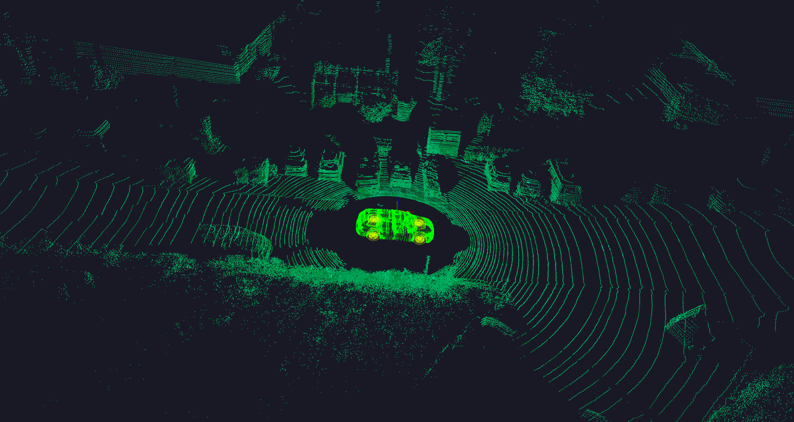

# 1. Overview
* derived from https://github.com/heremaps/pptk
* modifed for own usage
* only cmake build tested
* test environment, qt 5.15.0, python 3.8

# 2.Install
```
$ cd ${project_dir}
$ mkdir build
$ cd build
$ cmake -DCMAKE_BUILD_TYPE=Release ..
$ make -j8

// install python interface (optional)
cp lidarviewer_exec ../lidarviewer // copy qt gui app to package folder
cd ..
python setup.py bdist_wheel  // compile pip package 
pip install dist/{package_name}.whl  // under your virtual env
```

* copy Qt gui app to package folder


# 3. usage
* use Qt app directly
```
$ cd ${project_dir}
$ ./build/bin/example_lidarviewer {socket_port}
```

* with python api
```python
from lidarviewer import LidarViewer
test = LidarViewer()  # use random socket port
test.load_np_file("/media/zzhou/data-KITTI/object/training/velodyne/000050.bin")
```

# 4. working as debug tools
* some initial results on KITTI data

